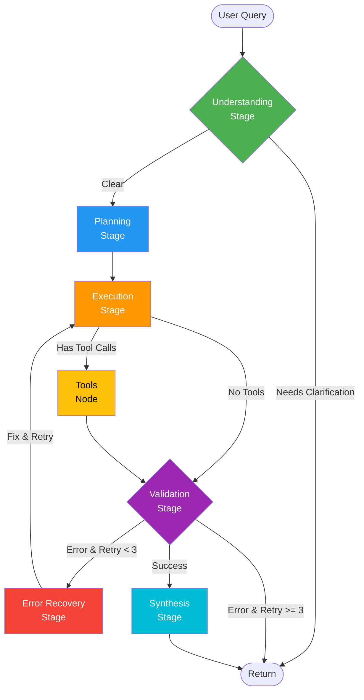

# 🚀 LangGraph Showcase: Multi-Stage Agent

This demonstrates **LangGraph's true power** with a production-ready multi-stage agent in ~300 lines.

## 🎯 LangGraph Superpowers Demonstrated

### 1. **State Management** 
Rich state with metadata tracking across stages:
```python
class AgentState(TypedDict):
    messages: Annotated[Sequence[BaseMessage], add_messages]
    stage: str              # Track current stage
    retry_count: int        # Error recovery counter
    needs_clarification: bool
    plan: dict             # Strategic plan
    error: str             # Error tracking
```

### 2. **Conditional Routing** 
Dynamic flow based on state:
```python
def route_after_validation(state) -> Literal["synthesis", "error_recovery", "end"]:
    error = state.get("error", "")
    retry_count = state.get("retry_count", 0)
    
    if error and retry_count < 3:
        return "error_recovery"  # Retry!
    elif error:
        return "end"             # Give up
    return "synthesis"           # Success!
```

### 3. **Cycles & Loops** 
Self-healing with retry logic:
```python
workflow.add_edge("error_recovery", "execution")  # Loop back!
```

### 4. **Multi-Stage Pipeline** 
5 stages like your architecture:
- Understanding → Planning → Execution → Validation → Synthesis

### 5. **Error Recovery** 
Automatic retry with self-healing (up to 3 attempts)

## 📊 Architecture Flow



## 🎨 Key Features

### ✅ Multi-Stage Processing
```python
# 5 distinct stages, each with clear responsibility
workflow.add_node("understanding", understanding_node)
workflow.add_node("planning", planning_node)
workflow.add_node("execution", execution_node)
workflow.add_node("validation", validation_node)
workflow.add_node("synthesis", synthesis_node)
```

### ✅ Conditional Routing
```python
# Different paths based on state
workflow.add_conditional_edges("understanding", route_after_understanding)
workflow.add_conditional_edges("execution", route_after_execution)
workflow.add_conditional_edges("validation", route_after_validation)
```

### ✅ Error Recovery Loop
```python
# Automatic retry with self-healing
workflow.add_node("error_recovery", error_recovery_node)
workflow.add_edge("error_recovery", "execution")  # Loop!
```

### ✅ Tool Integration
```python
# Seamless tool calling with ToolNode
workflow.add_node("tools", ToolNode(tools))
workflow.add_conditional_edges("execution", route_after_execution)
```

### ✅ State Tracking
```python
# Rich metadata throughout the flow
state["stage"] = "execution"
state["retry_count"] += 1
state["error"] = "Query failed"
```

## 🔥 Why This Shows LangGraph Power

### 1. **Declarative Flow**
Define the graph structure, LangGraph handles execution:
```python
workflow.add_edge(START, "understanding")
workflow.add_conditional_edges("understanding", route_after_understanding)
workflow.add_edge("planning", "execution")
# ... LangGraph figures out the rest!
```

### 2. **Automatic State Management**
No manual state passing - LangGraph handles it:
```python
# State flows automatically through nodes
def understanding_node(state: AgentState) -> AgentState:
    # Modify state
    return {**state, "stage": "understanding"}
```

### 3. **Built-in Cycles**
Retry loops without manual recursion:
```python
# This creates a cycle - LangGraph handles it!
workflow.add_edge("error_recovery", "execution")
```

### 4. **Type Safety**
TypedDict ensures state consistency:
```python
class AgentState(TypedDict):
    messages: Annotated[Sequence[BaseMessage], add_messages]
    stage: str
    retry_count: int
```

### 5. **Observability**
Built-in LangSmith tracing for every step

## 🆚 Comparison

### Your Current Architecture (Complex)
- 26 files, thousands of lines
- Manual state management
- Complex error handling
- Hard to trace flow

### LangGraph Showcase (Simple)
- 1 file, ~300 lines
- Automatic state management
- Declarative error recovery
- Built-in tracing

### Same Power, Less Code!

## 🚀 Run It

```bash
python agent_langgraph_showcase.py
```

## 📈 What You Get

1. **5-Stage Pipeline** - Understanding → Planning → Execution → Validation → Synthesis
2. **Conditional Routing** - Dynamic flow based on state
3. **Error Recovery** - Automatic retry with self-healing (up to 3 attempts)
4. **Tool Integration** - Seamless BigQuery execution
5. **State Tracking** - Rich metadata throughout
6. **LangSmith Tracing** - Full observability

## 💡 Key Insights

### LangGraph Excels At:
- ✅ **Multi-stage workflows** with conditional routing
- ✅ **Error recovery** with retry loops
- ✅ **State management** across complex flows
- ✅ **Tool orchestration** with automatic routing
- ✅ **Observability** with built-in tracing

### Perfect For:
- Complex agent workflows
- Multi-step reasoning
- Error-prone operations (SQL, APIs)
- Production systems needing reliability
- Teams needing maintainability

## 🎯 The Power

**300 lines of LangGraph** replaces **thousands of lines** of manual orchestration while providing:
- Better error handling
- Clearer flow
- Easier debugging
- Type safety
- Built-in observability

**That's the power of LangGraph!** 🚀
