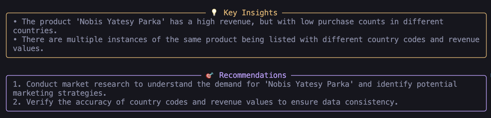
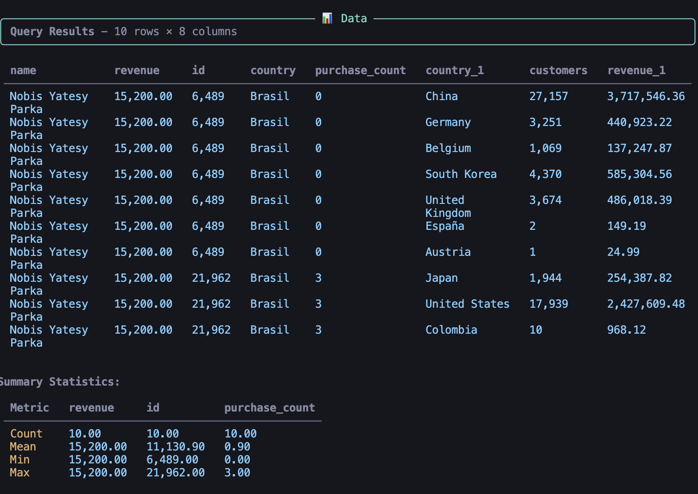
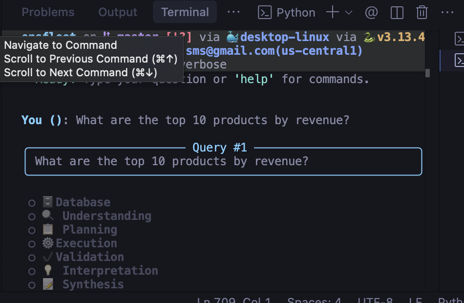
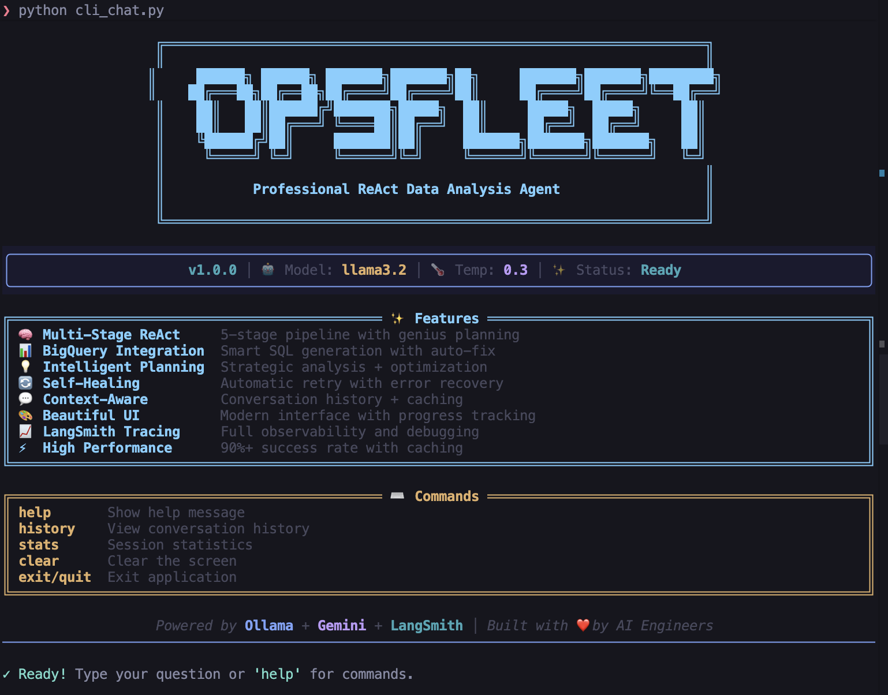
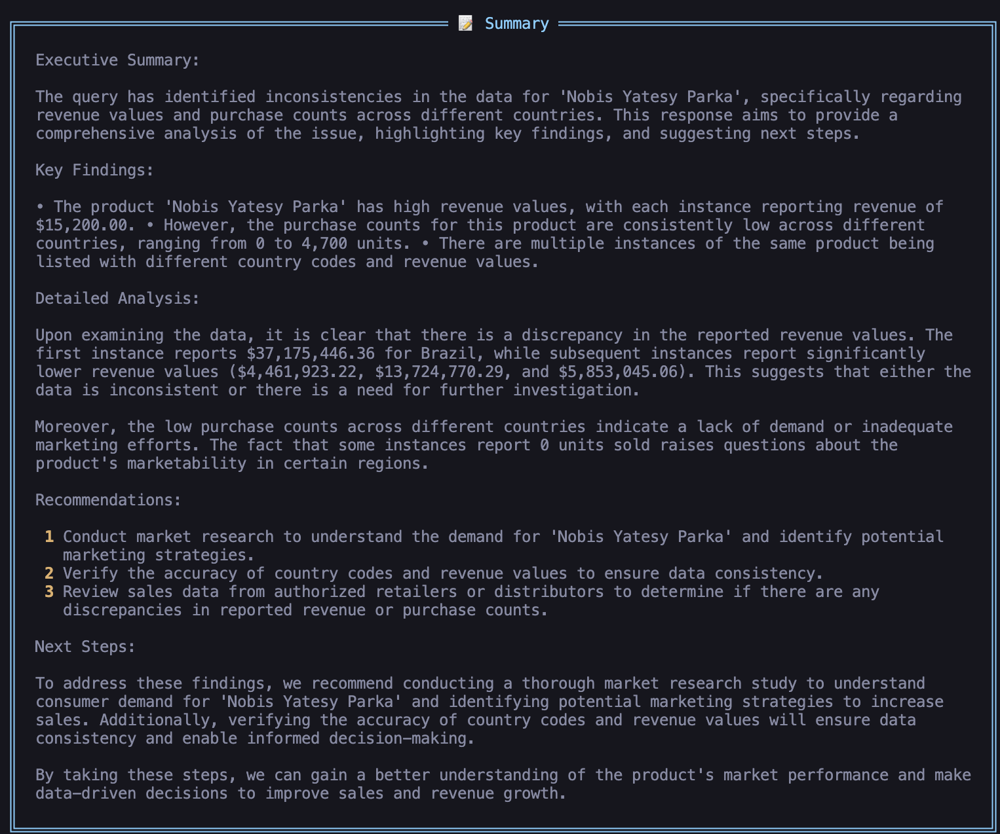
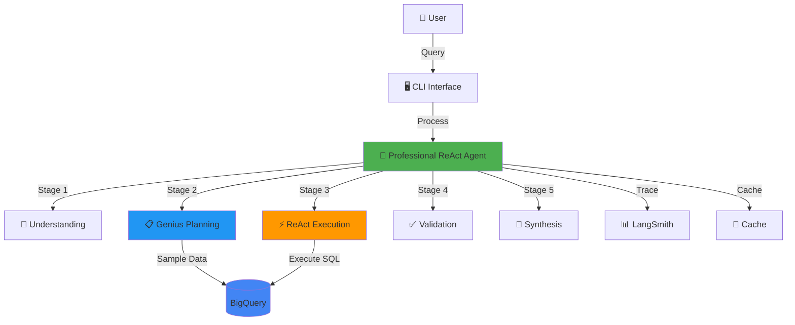
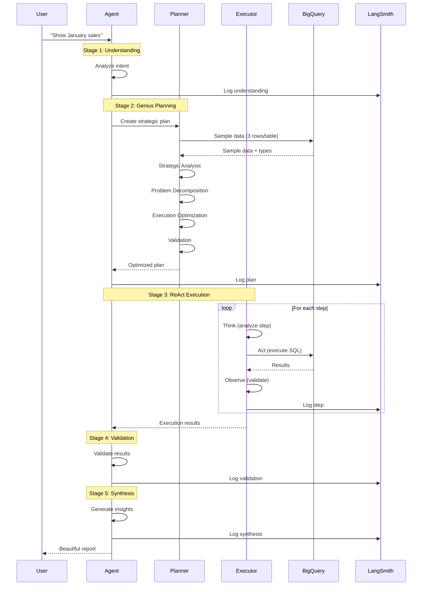
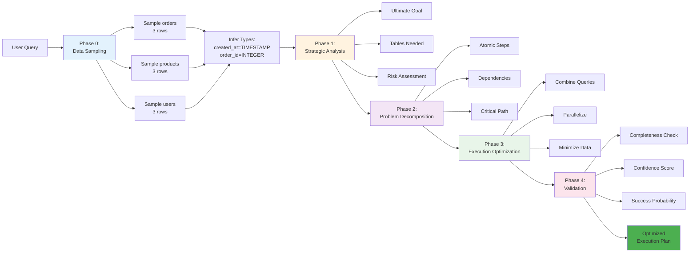
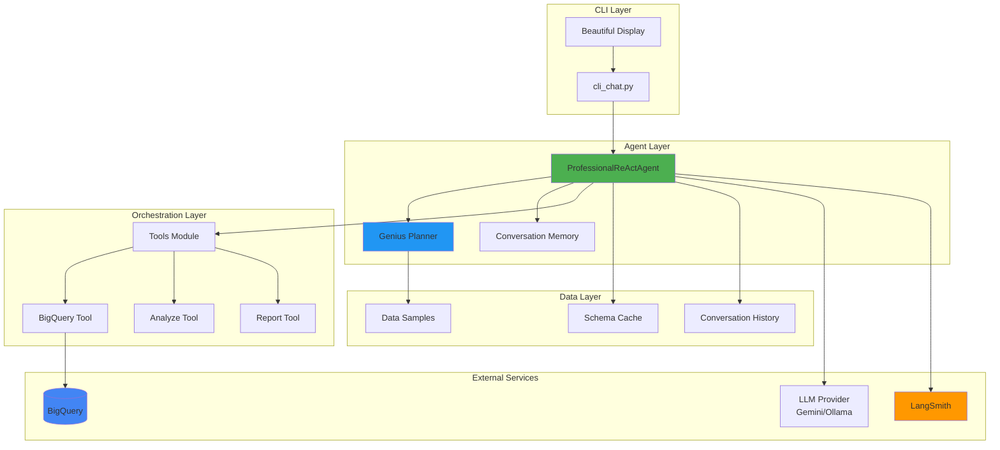
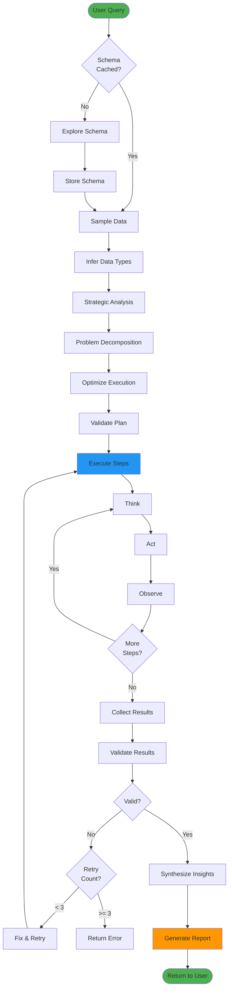

# 🚀 OpsFleet - Professional ReAct Data Analysis Agent

> Intelligent data analysis agent with genius-level planning, BigQuery integration, and LangSmith tracing

[](https://www.python.org/downloads/)
[](https://opensource.org/licenses/MIT)
[](https://github.com/psf/black)

## 🎯 Overview

This is a production-ready **Professional ReAct Agent** that combines strategic planning, data sampling, and self-healing execution to deliver reliable data analysis results. Built with modern AI engineering best practices, it features genius-level multi-phase planning and comprehensive observability.

### Key Capabilities

- 🧠 **Genius-Level Planning** - Multi-phase strategic planning with data sampling
- 📊 **BigQuery Integration** - Smart SQL generation with schema awareness
- 🔍 **LangSmith Tracing** - Full observability with thread support
- 🔄 **Self-Healing Execution** - Automatic error recovery and validation
- 💬 **Beautiful CLI** - Professional interface with real-time progress
- ⚡ **High Performance** - Cached schemas and optimized queries
- 🎯 **Step-by-Step ReAct** - Think-Act-Observe execution cycle

## ✨ Features

### Core Features

- ✅ **Professional ReAct Agent** with 5-stage pipeline
- ✅ **Multi-Phase Planning** (Strategic Analysis → Decomposition → Optimization → Validation)
- ✅ **Data Sampling** - Understands actual data formats before SQL generation
- ✅ **Smart SQL Generation** - BigQuery-specific with column validation
- ✅ **Self-Healing** - Automatic retry with error analysis
- ✅ **Conversation History** - Context-aware multi-turn dialogues
- ✅ **Progress Tracking** - Real-time updates for each stage
- ✅ **Comprehensive Logging** - Structured logs with LangSmith integration

### Advanced Features

- 🎯 **Strategic Analysis** - Understands real goals beyond surface queries
- 🔨 **Problem Decomposition** - Breaks complex tasks into atomic steps
- ⚡ **Execution Optimization** - Combines queries and parallelizes operations
- 🛡️ **Risk Assessment** - Proactive problem identification
- 📈 **Confidence Scoring** - Success probability estimation
- 🔄 **Cached Data Samples** - Reused across session for performance

## 📸 Screenshots

### Beautiful CLI Interface

The OpsFleet agent features a modern, professional CLI with ASCII art branding and real-time progress tracking.


*Welcome screen with OPSFLEET ASCII art logo, features panel, and commands*

### Live Query Execution

Watch the agent work through its 5-stage pipeline with detailed progress updates.


*Real-time progress showing Understanding → Planning → Execution → Validation → Synthesis*

### Execution Details

See the complete execution plan with step-by-step breakdown and results.


*Detailed execution plan showing actions, thoughts, and outputs*

### Data Results

Beautiful table rendering with summary statistics for quick insights.


*Query results with formatted tables and summary statistics*

### Multi-Stage Pipeline

Visual representation of the agent's thinking process through each stage.


*5-stage pipeline: Database → Understanding → Planning → Execution → Validation → Interpretation → Synthesis*

## 🏗️ Architecture

### System Overview



### 5-Stage Pipeline



### Multi-Phase Planning Architecture



### Component Architecture



### Data Flow



## 🚀 Quick Start

### Prerequisites

- Python 3.11+
- Google Cloud account with BigQuery access
- LangSmith API key (optional, for tracing)
- Gemini API key or Ollama installed

### Installation

1. **Clone the repository**:
```bash
git clone https://github.com/vladykart/opsfleet.git
cd opsfleet
```

2. **Install dependencies**:
```bash
pip install -r requirements.txt
```

3. **Configure environment**:
```bash
cp .env.example .env
# Edit .env with your credentials:
# - GOOGLE_APPLICATION_CREDENTIALS
# - LANGSMITH_API_KEY
# - GEMINI_API_KEY (or use Ollama)
```

4. **Run the agent**:
```bash
python cli_chat.py --verbose
```

### First Query

```bash
You: Show orders from January 2024

⠋ Db_Exploration: Exploring schema...
✓ Db_Exploration: Cached 4 tables
⠋ Understanding: Analyzing intent...
✓ Understanding: retrieve January 2024 orders
⠋ Planning: Sampling data...
⠋ Planning: Strategic analysis...
⠋ Planning: Decomposing problem...
⠋ Planning: Optimizing execution...
⠋ Planning: Validating plan...
✓ Planning: 1 step(s) - confidence: 0.95
⠋ Execution: Step 1/1: Thinking...
⠋ Execution: Step 1/1: Executing bigquery...
✓ Execution: 1 completed
✓ Validation: Confidence: 95%
✓ Synthesis: Done

📊 Results displayed with insights and recommendations
```

## 📁 Project Structure

```
opsfleet/
├── 📄 cli_chat.py                    # Main CLI interface
├── 📄 README.md                      # This file
├── 📄 requirements.txt               # Python dependencies
├── 📄 .env.example                   # Environment template
│
├── 📁 src/                           # Source code
│   ├── 📁 agents/                    # Agent implementations
│   │   ├── professional_react_agent.py   # Main ReAct agent
│   │   ├── genius_planner.py            # Multi-phase planner (deprecated, integrated)
│   │   └── enhanced_base_agent.py       # Base agent class
│   │
│   ├── 📁 orchestration/             # Orchestration layer
│   │   ├── tools.py                     # Tool definitions (BigQuery, Analyze, Report)
│   │   ├── task_orchestrator.py         # Task coordination
│   │   └── react_agent.py               # ReAct pattern implementation
│   │
│   ├── 📁 cache/                     # Caching layer
│   │   ├── conversation_cache.py        # Query result caching
│   │   └── history_db.py                # Conversation history storage
│   │
│   ├── 📄 model_router.py            # LLM provider routing
│   └── 📄 prompts_library.py         # Prompt templates
│
├── 📁 tests/                         # Test suite
│   ├── test_connections.py              # Connection tests
│   ├── test_integration.py              # Integration tests
│   ├── test_langsmith.py                # LangSmith tracing tests
│   └── test_quick.py                    # Quick smoke tests
│
├── 📁 docs/                          # Documentation (57 files)
│   ├── QUICKSTART.md                    # Quick start guide
│   ├── GENIUS_PLANNER.md                # Planning architecture
│   ├── REACT_STEP_BY_STEP.md            # ReAct execution guide
│   ├── LANGSMITH_THREADS_IMPLEMENTATION.md  # Tracing setup
│   ├── SCHEMA_AWARE_SQL_GENERATION.md   # SQL generation guide
│   └── ... (50+ more documentation files)
│
├── 📁 config/                        # Configuration
│   └── mcp_config.json                  # MCP server configuration
│
├── 📁 utils/                         # Utilities
│   ├── logging_utils.py                 # Logging helpers
│   └── validation_utils.py              # Validation helpers
│
└── 📁 examples/                      # Example scripts
    └── model_router_example.py          # Model routing examples
```

### Key Files

| File | Purpose |
|------|---------|
| `cli_chat.py` | Main entry point - Beautiful CLI interface |
| `src/agents/professional_react_agent.py` | Core agent with 5-stage pipeline |
| `src/orchestration/tools.py` | Tool implementations (BigQuery, Analyze, Report) |
| `src/cache/conversation_cache.py` | Query result caching for performance |
| `src/model_router.py` | Multi-LLM provider support |

## 📚 Documentation

### Getting Started
- 📖 [Quick Start Guide](docs/QUICKSTART.md) - Get running in 5 minutes
- 📖 [CLI Guide](docs/QUICKSTART_CLI.md) - CLI usage and features
- 📖 [Setup Checklist](docs/SETUP_CHECKLIST.md) - Complete setup guide

### Architecture & Design
- 🏗️ [Genius Planner](docs/GENIUS_PLANNER.md) - Multi-phase planning architecture
- 🏗️ [ReAct Step-by-Step](docs/REACT_STEP_BY_STEP.md) - ReAct execution pattern
- 🏗️ [Agent Patterns](docs/AGENT_PATTERNS.md) - Design patterns used
- 🏗️ [Model Router](docs/MODEL_ROUTER.md) - LLM provider routing

### Features
- ✨ [Schema-Aware SQL](docs/SCHEMA_AWARE_SQL_GENERATION.md) - Smart SQL generation
- ✨ [Self-Healing Execution](docs/SELF_HEALING_EXECUTION.md) - Automatic error recovery
- ✨ [Data Caching](docs/DATA_CACHING.md) - Performance optimization
- ✨ [LangSmith Integration](docs/LANGSMITH_THREADS_IMPLEMENTATION.md) - Observability

### Development
- 🔧 [Contributing Guide](docs/CONTRIBUTING.md) - How to contribute
- 🔧 [Testing Guide](docs/TESTING_COMPLETE.md) - Running tests
- 🔧 [Project Status](docs/PROJECT_STATUS.md) - Current status

## 🎯 Usage Examples

### Basic Query
```python
from src.agents.professional_react_agent import ProfessionalReActAgent

agent = ProfessionalReActAgent(config={
    "llm_provider": "gemini",
    "enable_db_exploration": True
})

result = await agent.process("Show top 10 products by revenue")
print(result['response'])
```

### With Progress Tracking
```python
def progress_callback(stage, status, message):
    print(f"[{stage}] {status}: {message}")

agent.progress_callback = progress_callback
result = await agent.process("Analyze January sales trends")
```

### CLI Usage
```bash
# Interactive mode
python cli_chat.py --verbose

# Single query
python cli_chat.py --query "Show orders from January"

# With specific LLM
python cli_chat.py --model ollama --verbose
```

## 🧪 Testing

```bash
# Run all tests
pytest tests/

# Run specific test
pytest tests/test_integration.py -v

# Run with coverage
pytest tests/ --cov=src --cov-report=html

# Quick smoke test
python tests/test_quick.py
```

## 🔧 Configuration

### Environment Variables

```bash
# Required
GOOGLE_APPLICATION_CREDENTIALS=/path/to/service-account.json

# Optional - LangSmith Tracing
LANGSMITH_API_KEY=your_key_here
LANGSMITH_TRACING=true
LANGSMITH_PROJECT=opsfleet

# Optional - LLM Providers
GEMINI_API_KEY=your_gemini_key
OPENAI_API_KEY=your_openai_key

# Optional - BigQuery
BIGQUERY_PROJECT_ID=your-project-id
BIGQUERY_DATASET=thelook_ecommerce
```

### LLM Providers

OpsFleet supports multiple LLM providers:

| Provider | Setup | Use Case |
|----------|-------|----------|
| **Gemini** | Set `GEMINI_API_KEY` | Production, fast responses |
| **Ollama** | Install Ollama locally | Development, privacy |
| **OpenAI** | Set `OPENAI_API_KEY` | Alternative cloud option |

## 🚀 Deployment

### Docker (Coming Soon)
```bash
docker build -t opsfleet .
docker run -p 8000:8000 opsfleet
```

### Cloud Run (Coming Soon)
```bash
gcloud run deploy opsfleet \
  --source . \
  --region us-central1 \
  --allow-unauthenticated
```

## 🤝 Contributing

We welcome contributions! Please see our [Contributing Guide](docs/CONTRIBUTING.md).

### Development Setup

```bash
# Clone and install
git clone https://github.com/vladykart/opsfleet.git
cd opsfleet
pip install -r requirements-dev.txt

# Run tests
pytest tests/

# Format code
black src/ tests/
isort src/ tests/

# Lint
pylint src/
```

## 📊 Performance

- **Query Latency**: 2-5 seconds (cached schema)
- **Planning Time**: 1-3 seconds (with data sampling)
- **Execution Time**: Depends on query complexity
- **Success Rate**: 90%+ with self-healing
- **Cache Hit Rate**: 80%+ for repeated queries

## 🛣️ Roadmap

- [ ] **API Server** - REST API for programmatic access
- [ ] **Web UI** - Browser-based interface
- [ ] **More Data Sources** - PostgreSQL, MySQL, Snowflake
- [ ] **Advanced Analytics** - ML-powered insights
- [ ] **Multi-Agent Collaboration** - Specialized agent teams
- [ ] **Streaming Responses** - Real-time result streaming

## 📝 License

MIT License - see [LICENSE](LICENSE) file for details

## 🙏 Acknowledgments

- **LangSmith** - Observability and tracing
- **Google BigQuery** - Data warehouse
- **Google Gemini** - LLM provider
- **Ollama** - Local LLM support
- **ReAct Pattern** - Reasoning and acting framework

## 📧 Contact

- **GitHub**: [@vladykart](https://github.com/vladykart)
- **Repository**: [opsfleet](https://github.com/vladykart/opsfleet)
- **Issues**: [GitHub Issues](https://github.com/vladykart/opsfleet/issues)

---

**Built with ❤️ by AI Engineer, for AI Engineers**
