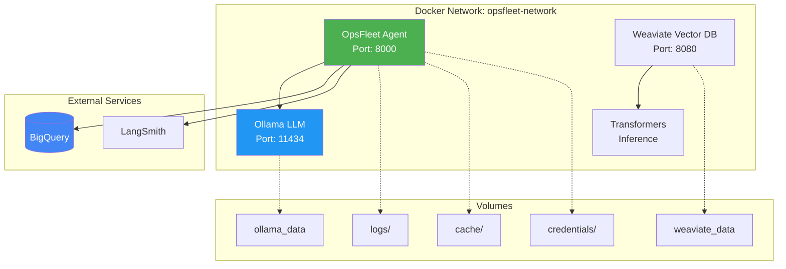

# 🐳 Docker Deployment Guide

> Complete guide for deploying OpsFleet with Docker and Docker Compose

## Table of Contents

1. [Quick Start](#quick-start)
2. [Architecture](#architecture)
3. [Configuration](#configuration)
4. [Services](#services)
5. [Deployment Scenarios](#deployment-scenarios)
6. [Troubleshooting](#troubleshooting)

## Quick Start

### Prerequisites

- Docker 20.10+
- Docker Compose 2.0+
- Google Cloud service account key
- (Optional) LangSmith API key

### 1. Prepare Environment

```bash
# Clone repository
git clone https://github.com/vladykart/opsfleet.git
cd opsfleet

# Create .env file
cp .env.example .env

# Edit .env with your credentials
nano .env
```

### 2. Set Environment Variables

```bash
# Required
export BIGQUERY_PROJECT_ID=your-project-id
export GOOGLE_APPLICATION_CREDENTIALS=./credentials/service-account.json

# Optional - LangSmith
export LANGSMITH_API_KEY=your-langsmith-key

# Optional - Gemini (or use Ollama)
export GEMINI_API_KEY=your-gemini-key
```

### 3. Start Services

```bash
# Start all services
docker-compose up -d

# Or start specific services
docker-compose up -d opsfleet ollama

# View logs
docker-compose logs -f opsfleet
```

### 4. Verify Deployment

```bash
# Check service health
docker-compose ps

# Test the agent
docker-compose exec opsfleet python cli_chat.py --query "Show orders from January"
```

## Architecture

### Docker Compose Services



### Multi-Stage Dockerfile

```dockerfile
# Stage 1: Builder
FROM python:3.11-slim as builder
# Install dependencies in virtual environment

# Stage 2: Production
FROM python:3.11-slim
# Copy venv and application code
# Run as non-root user
```

**Benefits**:
- Smaller final image (~200MB vs ~500MB)
- Faster builds with layer caching
- Security: runs as non-root user
- Production-ready

## Configuration

### Environment Variables

#### Required

| Variable | Description | Example |
|----------|-------------|---------|
| `GOOGLE_APPLICATION_CREDENTIALS` | Path to service account JSON | `/app/credentials/service-account.json` |
| `BIGQUERY_PROJECT_ID` | GCP project ID | `my-project-123` |

#### Optional - LangSmith

| Variable | Description | Default |
|----------|-------------|---------|
| `LANGSMITH_API_KEY` | LangSmith API key | - |
| `LANGSMITH_TRACING` | Enable tracing | `true` |
| `LANGSMITH_PROJECT` | Project name | `opsfleet` |

#### Optional - LLM Provider

| Variable | Description | Default |
|----------|-------------|---------|
| `LLM_PROVIDER` | LLM provider | `gemini` |
| `GEMINI_API_KEY` | Gemini API key | - |
| `OLLAMA_BASE_URL` | Ollama URL | `http://ollama:11434` |
| `OLLAMA_MODEL` | Ollama model | `llama3.2` |

#### Optional - Application

| Variable | Description | Default |
|----------|-------------|---------|
| `LOG_LEVEL` | Logging level | `INFO` |
| `ENABLE_CACHE` | Enable caching | `true` |
| `CACHE_TTL` | Cache TTL (seconds) | `3600` |

### Volume Mounts

| Host Path | Container Path | Purpose |
|-----------|----------------|---------|
| `./credentials` | `/app/credentials` | Service account keys (read-only) |
| `./logs` | `/app/logs` | Application logs |
| `./cache` | `/app/cache` | Query cache |
| `ollama_data` | `/root/.ollama` | Ollama models |
| `weaviate_data` | `/var/lib/weaviate` | Weaviate data |

## Services

### 1. OpsFleet Agent

**Purpose**: Main application container

**Ports**: 8000 (for future API server)

**Health Check**:
```bash
docker-compose exec opsfleet python -c "import sys; sys.exit(0)"
```

**Logs**:
```bash
docker-compose logs -f opsfleet
```

**Interactive Shell**:
```bash
docker-compose exec opsfleet bash
```

### 2. Ollama (Local LLM)

**Purpose**: Local LLM inference server

**Ports**: 11434

**Pull Models**:
```bash
# Pull llama3.2
docker-compose exec ollama ollama pull llama3.2

# Pull other models
docker-compose exec ollama ollama pull mistral
docker-compose exec ollama ollama pull codellama
```

**List Models**:
```bash
docker-compose exec ollama ollama list
```

**Test Ollama**:
```bash
curl http://localhost:11434/api/tags
```

### 3. Weaviate (Vector Database)

**Purpose**: Vector storage for semantic search (optional, for future features)

**Ports**: 8080

**Health Check**:
```bash
curl http://localhost:8080/v1/.well-known/ready
```

**Query Weaviate**:
```bash
curl http://localhost:8080/v1/schema
```

### 4. Transformers Inference

**Purpose**: Text embedding for Weaviate

**Internal Service**: No external ports

## Deployment Scenarios

### Scenario 1: Development with Ollama

**Use Case**: Local development, no external API costs

```bash
# Start OpsFleet + Ollama
docker-compose up -d opsfleet ollama

# Pull model
docker-compose exec ollama ollama pull llama3.2

# Set environment
export LLM_PROVIDER=ollama
export OLLAMA_MODEL=llama3.2

# Run agent
docker-compose exec opsfleet python cli_chat.py --verbose
```

**Pros**:
- ✅ No API costs
- ✅ Privacy (data stays local)
- ✅ Fast iteration

**Cons**:
- ❌ Slower inference
- ❌ Requires GPU for best performance
- ❌ Limited model selection

### Scenario 2: Production with Gemini

**Use Case**: Production deployment, fast responses

```bash
# Set environment
export LLM_PROVIDER=gemini
export GEMINI_API_KEY=your-key

# Start OpsFleet only (no Ollama needed)
docker-compose up -d opsfleet

# Run agent
docker-compose exec opsfleet python cli_chat.py --verbose
```

**Pros**:
- ✅ Fast inference
- ✅ High quality responses
- ✅ Scalable

**Cons**:
- ❌ API costs
- ❌ Requires internet
- ❌ Data sent to external service

### Scenario 3: Full Stack with All Services

**Use Case**: Complete deployment with all features

```bash
# Start all services
docker-compose up -d

# Wait for services to be healthy
docker-compose ps

# Pull Ollama model
docker-compose exec ollama ollama pull llama3.2

# Run agent
docker-compose exec opsfleet python cli_chat.py --verbose
```

**Services Running**:
- ✅ OpsFleet Agent
- ✅ Ollama (local LLM)
- ✅ Weaviate (vector DB)
- ✅ Transformers (embeddings)

### Scenario 4: Minimal (OpsFleet Only)

**Use Case**: Minimal footprint, use external services

```bash
# Start only OpsFleet
docker-compose up -d opsfleet

# Use Gemini for LLM
export LLM_PROVIDER=gemini
export GEMINI_API_KEY=your-key
```

## Docker Commands

### Build and Start

```bash
# Build images
docker-compose build

# Build without cache
docker-compose build --no-cache

# Start services
docker-compose up -d

# Start specific service
docker-compose up -d opsfleet

# Start with logs
docker-compose up
```

### Manage Services

```bash
# Stop services
docker-compose stop

# Stop specific service
docker-compose stop opsfleet

# Restart services
docker-compose restart

# Remove containers
docker-compose down

# Remove containers and volumes
docker-compose down -v
```

### Logs and Debugging

```bash
# View logs
docker-compose logs

# Follow logs
docker-compose logs -f opsfleet

# Last 100 lines
docker-compose logs --tail=100 opsfleet

# Interactive shell
docker-compose exec opsfleet bash

# Run command
docker-compose exec opsfleet python cli_chat.py --query "test"
```

### Health and Status

```bash
# Check service status
docker-compose ps

# Check health
docker-compose ps | grep healthy

# Resource usage
docker stats

# Inspect service
docker-compose exec opsfleet env
```

## Troubleshooting

### Issue: Container Fails to Start

**Symptoms**:
```
opsfleet-agent | Error: No module named 'google.cloud'
```

**Solution**:
```bash
# Rebuild image
docker-compose build --no-cache opsfleet
docker-compose up -d opsfleet
```

### Issue: Cannot Connect to BigQuery

**Symptoms**:
```
Error: Could not authenticate with BigQuery
```

**Solution**:
```bash
# Check credentials mount
docker-compose exec opsfleet ls -la /app/credentials/

# Verify environment variable
docker-compose exec opsfleet env | grep GOOGLE_APPLICATION_CREDENTIALS

# Check credentials file
docker-compose exec opsfleet cat /app/credentials/service-account.json
```

### Issue: Ollama Model Not Found

**Symptoms**:
```
Error: model 'llama3.2' not found
```

**Solution**:
```bash
# Pull model
docker-compose exec ollama ollama pull llama3.2

# List available models
docker-compose exec ollama ollama list

# Check Ollama health
curl http://localhost:11434/api/tags
```

### Issue: Out of Memory

**Symptoms**:
```
Container killed (OOMKilled)
```

**Solution**:
```bash
# Increase Docker memory limit
# Docker Desktop: Settings → Resources → Memory → 8GB+

# Or limit Ollama memory in docker-compose.yml
services:
  ollama:
    deploy:
      resources:
        limits:
          memory: 4G
```

### Issue: Permission Denied

**Symptoms**:
```
PermissionError: [Errno 13] Permission denied: '/app/logs'
```

**Solution**:
```bash
# Fix permissions on host
chmod -R 777 logs cache

# Or run as root (not recommended)
docker-compose exec --user root opsfleet bash
```

### Issue: Port Already in Use

**Symptoms**:
```
Error: bind: address already in use
```

**Solution**:
```bash
# Find process using port
lsof -i :8000

# Kill process or change port in docker-compose.yml
ports:
  - "8001:8000"  # Use different host port
```

## Production Best Practices

### 1. Security

```yaml
# Use secrets for sensitive data
secrets:
  google_credentials:
    file: ./credentials/service-account.json

services:
  opsfleet:
    secrets:
      - google_credentials
```

### 2. Resource Limits

```yaml
services:
  opsfleet:
    deploy:
      resources:
        limits:
          cpus: '2'
          memory: 2G
        reservations:
          cpus: '1'
          memory: 1G
```

### 3. Logging

```yaml
services:
  opsfleet:
    logging:
      driver: "json-file"
      options:
        max-size: "10m"
        max-file: "3"
```

### 4. Health Checks

```yaml
services:
  opsfleet:
    healthcheck:
      test: ["CMD", "python", "-c", "import sys; sys.exit(0)"]
      interval: 30s
      timeout: 10s
      retries: 3
      start_period: 40s
```

### 5. Restart Policy

```yaml
services:
  opsfleet:
    restart: unless-stopped  # or 'always'
```

## Monitoring

### Prometheus Metrics (Future)

```yaml
services:
  opsfleet:
    ports:
      - "9090:9090"  # Metrics endpoint
```

### Log Aggregation

```yaml
services:
  opsfleet:
    logging:
      driver: "fluentd"
      options:
        fluentd-address: "localhost:24224"
        tag: "opsfleet"
```

## Scaling

### Horizontal Scaling

```bash
# Scale to 3 instances
docker-compose up -d --scale opsfleet=3

# Use load balancer
# Add nginx or traefik for load balancing
```

### Vertical Scaling

```yaml
services:
  opsfleet:
    deploy:
      resources:
        limits:
          cpus: '4'
          memory: 8G
```

## Cleanup

```bash
# Stop and remove containers
docker-compose down

# Remove volumes
docker-compose down -v

# Remove images
docker-compose down --rmi all

# Clean up everything
docker system prune -a --volumes
```

## Summary

**Docker deployment provides**:
- ✅ **Consistent Environment** - Same setup everywhere
- ✅ **Easy Deployment** - One command to start
- ✅ **Isolation** - Services in separate containers
- ✅ **Scalability** - Easy to scale horizontally
- ✅ **Portability** - Run anywhere Docker runs

**For production**, consider:
- Using Docker Swarm or Kubernetes
- Implementing proper secrets management
- Setting up monitoring and logging
- Configuring backups for volumes
- Using a reverse proxy (nginx/traefik)

---

**For more information, see the [main README](../README.md) and [Architecture Guide](ARCHITECTURE.md).**
